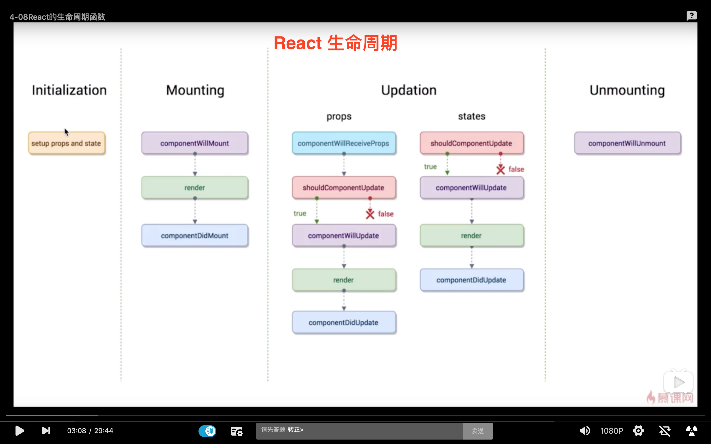

#  React核心技术剖析


## 虚拟 Dom

传统的开发方式关心的是 DOM 操作如何对应数据变动。React 和 Vue 之流开发者无须操作 DOM，而是关心的是数据流动，因为 MVVM 框架中很重要，但是在名字上没有体现出重要性的 binder 层（负责 view 到 model 的绑定关系）帮我们做好了。你只需要关心数据。

那么如何实现的呢？我们知道 DOM 操作很耗费性能，但是到底消耗在哪里，重绘、渲染算一个，可以看看这篇[文章](https://github.com/FantasticLBP/knowledge-kit/blob/master/第二部分%20Web%20前端/2.31.md)。
结合开发步骤想想看，先声明数据，再写 jsx 模版，然后数据驱动（setState），diff 算法找出变动的地方，然后组件重新渲染。

所以虚拟 DOM 本质上来看就是 JSX 对象。将一个 DOM 节点用 js 对象模拟表示出来， 然后再每次数据变动之后，根据数据和样式模版渲染生成新的虚拟 DOM。再利用 Diff 算法计算出差异部分，再去渲染。

React 性能高效的一个原因就是 Virtual DOM 的应用和 diff 之后的批量处理。（有 Native 开发经验的同学对于这里应该有似曾相识的感觉，和 RunLoop 很像。任何 UI 层变动的东西提交给系统，系统再下一次的运行循环到来的时候统一去渲染。）


## 虚拟 Dom 的 Diff 算法

diff 算法大体上做的事情就是根据同样的虚拟 Dom 同层级节点去比较，发现当前的节点有差异，则不向下进行比较，直接将当前节点重新渲染。


## JSX 的原理

JSX 做的事情是为了告诉 React 样式模版是什么。本质上来说 JSX 就是 `React.createElement` 的可读性更强的版本。`React.createElement` 接收三个参数。参数1:标签类型；参数2:属性；参数3:子元素。


```Javascript
render () {
    const { content } = this.props
    return <div><span>item-testing</span></div>
}
// 等价于下面的写法
render () {
    const { content } = this.props
    return React.createElement('div', {}, React.createElement('span', {}, 'item-testing'))
}
```


### 生命周期




### 组件的写法

```javascript
// 功能组件
function Welcome (props) {
    return <h2>Hello, {props.name}</h2>;
}
// 等价于下面的写法。ES6 类
class Welcome extends React.Component {
    render () {
        return <h2>hello, {this.props.name}</h2>;
    }
}

```

### 开发tips
- 不要直接操作 state
- props 是只读的
- setState 的时候如果依赖之前的 state 数据，那么 setState 第一个参数可以更改为函数方式，这个函数有2个参数
  ```javascript
  setState((state, props) => ({ count: state.count + props.increment }));
  ```